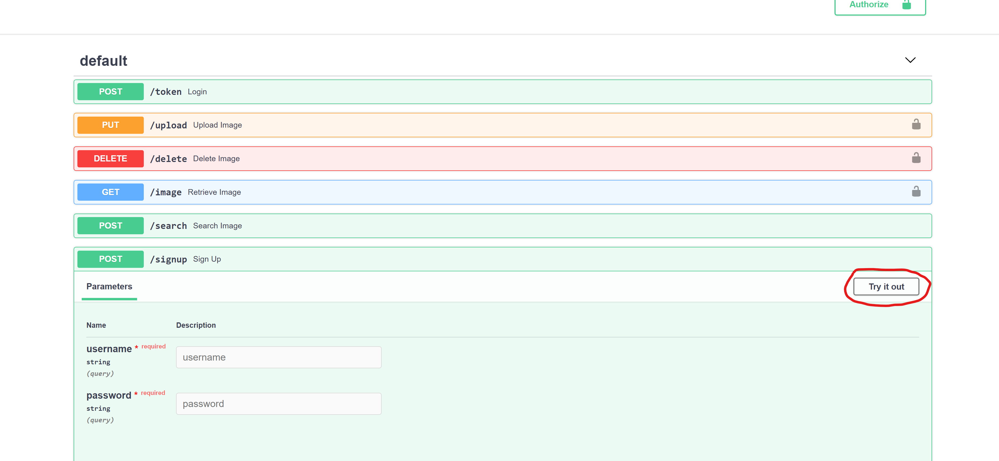
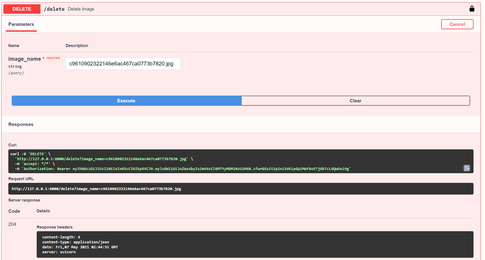

# image-repository

## Setup

```
pip install -r requirements.txt
```
## Usage
Run the following command to startup the app
```
uvicorn main:app --reload
```
Then we head to http://127.0.0.1:8000/docs so we can view and test all endpoints


 
 Since some endpoints require authorization we will signup. Expand the signup end point and click the `Try it Out` button to make the fields editable.
 


From here enter a user name and password. Then click Execute. This will output a 204 code which means no body.


Scroll back up to the top to authroize and generate a jwt token.


Enter the username and password you chose before and click `Authorize`. Then close the box


From here we can start uploading images to the repository. 


Now that the image has been uploaded (and is public) we can view it using the image endpoint.


First we can also upload another image so we can test the reverse image search.

Then upload a file to search by and the endpoint will output the names of the images closest to the one uploaded. These images can then be fetched from the `/image` endpoint if needed


We can also delete images by name. (make sure to be loged in for this otherwise it will output an error)



As we can see the `/image` endpoint tells us that the image does not exist


